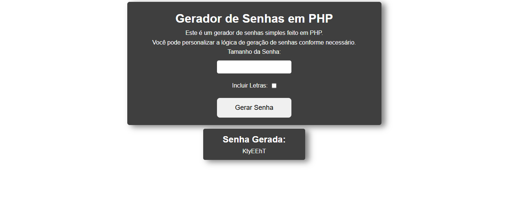

# 🔐 Gerador de Senhas em PHP

Este é um projeto simples de **gerador de senhas** feito com **HTML, CSS e PHP**.  
Permite que o usuário defina o **tamanho da senha** e escolha se deseja incluir **números** e/ou **letras**.

---

## 📸 Prévia



---

## 🚀 Funcionalidades

- Definir o tamanho da senha (até 20 caracteres)
- Escolher se deseja:
  - ✅ Incluir números
  - ✅ Incluir letras
- Geração dinâmica da senha via `PHP`

---

## 🧠 Tecnologias utilizadas

- HTML5
- CSS3
- PHP

---

## 🛠️ Como rodar localmente

> É necessário ter o **PHP instalado** no seu computador.

1. Clone o repositório:
   ```bash
   git clone https://github.com/seu-usuario/gerador-senhas-php.git
   ```
2. Navegue até a pasta do projeto:

  ```bash
  cd gerador-senhas-php
  ```
3.Inicie um servidor local com PHP:
  ```bash
  php -S localhost:8000
  ```
4. Acesse no navegador:
   ```bash
   http://localhost:8000
   ```
   
📄 Licença
Este projeto está sob a licença MIT.
Sinta-se à vontade para usar, modificar e compartilhar!
